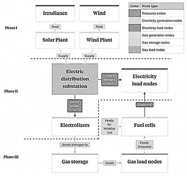

<div align="center">
  <h1 align="center">Data Management and Extended Results for: <br>Green Cities: A Two-Stage Stochastic Optimization Model for Renewable Energy Transition and Reuse</h1>
</div>

<div align="center">
  <a href="https://opensource.org/licenses/MIT">
    
  </a>
  <a href="https://doi.org/YOUR_DOI_HERE"> 
  </a>
  
</div>

<div style="background-color: #f6f8fa; padding: 15px; border-radius: 5px; border: 1px solid #e1e4e8;">
  <h2>Overview</h2>
  <p>This study proposes a two-stage stochastic model to optimize the integration of solar, wind, and green hydrogen production, specifically addressing uncertainty in renewable energy generation.</p>
</div>

<br>

<div align="center">
  
  <p><em>Fig. 1. General Zero Emissions Model Framework</em></p>
</div>

<br>

---

<h2>Key Results</h2>

<p>The simulations, conducted using AIMMS, validate the model's feasibility for Ecuador's Zone 1, demonstrating:</p>

<table width="100%">
  <tr>
    <td width="5%" valign="top" style="padding-right:10px; font-size: 20px;">✔️</td>
    <td valign="top"><strong>Technical and Economic Feasibility:</strong> The proposed system is viable for real-world implementation.</td>
  </tr>
  <tr>
    <td width="5%" valign="top" style="padding-right:10px; font-size: 20px;">📉</td>
    <td valign="top"><strong>Significant Emission Reduction:</strong> Achieves a <strong>72% reduction in emissions</strong> compared to conventional fossil fuel-dependent systems.</td>
  </tr>
  <tr>
    <td width="5%" valign="top" style="padding-right:10px; font-size: 20px;">🔋</td>
    <td valign="top"><strong>Improved Grid Stability:</strong> Integration of green hydrogen and fuel cells reduces shortfalls by 94%, positioning green hydrogen as a critical stabilizer for 100% renewable grids.</td>
  </tr>
</table>

<br>

<div style="background-color: #f6f8fa; padding: 15px; border-radius: 5px; border: 1px solid #e1e4e8;">
  <h2>Detailed Simulation Results and Analysis</h2>
  <p>This repository includes a comprehensive set of simulation results that complement the findings presented in the main research paper. These extended results provide a deeper insight into the model's performance, detailed energy balances, and the role of green hydrogen in different regions and scenarios.</p>
  <p>The results include:</p>
  <ul>
    <li>Comparison of electrical demand with solar, wind, and fuel cell generation across various locations and quarters.</li>
    <li>Detailed electricity generation contributions in cities and industrial districts, including auto-sufficiency rates.</li>
    <li>Quantification of green hydrogen production from renewable surpluses, its usage in fuel cells, and excess stored amounts.</li>
    <li>Connections between the simulation outputs and the key parameters and constraints within the AIMMS model.</li>
    <li>Underlying technical references for efficiencies and conversion factors used in the model.</li>
  </ul>  <p>For a full breakdown of the simulation outputs, detailed tables, and their analysis, please refer to the dedicated results file:</p>
  <p align="center">
    <a href="RESULTS.md"></a>
  </p>
  </div>

---

<h2>Getting Started</h2>

To explore and run the optimization model, you will need **AIMMS (Advanced Interactive Multidimensionally Modeling System)**. All simulations in the paper were run using **AIMMS Academic Version 4.81**.

<h3>Prerequisites</h3>

- **AIMMS:** Ensure you have an academic or commercial license for AIMMS (Version 4.81 or newer is recommended).
  - Download AIMMS: <a href="https://www.aimms.com/download/" target="_blank">https://www.aimms.com/download/</a>

<h3>Running the Model</h3>

1.  **Clone the repository:**
    ```bash
    git clone [https://github.com/johncortes117/greencities-twostage-stochastic-optimization.git](https://github.com/johncortes117/greencities-twostage-stochastic-optimization.git)
    ```
2.  **Navigate to the project directory:**
    ```bash
    cd greencities-two-stage-stochastic-optimization
    ```
3.  **Open the AIMMS project:** Locate and open the main AIMMS project file: `COMC_CP_UPEC_GOLD06.aimms` in your AIMMS installation. This file will load all associated model modules (`MainProject/`) and data (`data/`).
4.  **Execute the model:** The AIMMS project is configured to run the two-stage stochastic optimization. Navigate within the AIMMS environment to the relevant pages or procedures (e.g., "Run Model", "Solve Scenario") to execute the simulation. The model is structured hierarchically, with Stage I (investment decisions) preceding Stage II (operational decisions under scenarios).

<h3>Data</h3>

The `data/` folder contains the necessary input data, including `data.xlsx`, used for the simulations presented in the paper. This data is crucial for replicating the study's results and understanding the specific case study in Ecuador's Zone 1.

---

<h2>Repository Contents</h2>

<table width="100%">
  <thead>
    <tr>
      <th align="left">File/Directory</th>
      <th align="left">Description</th>
    </tr>
  </thead>
  <tbody>
    <tr>
      <td valign="top"><code>COMC_CP_UPEC_GOLD06.aimms</code></td>
      <td valign="top">The main AIMMS project file, which orchestrates the entire model.</td>
    </tr>
    <tr>
      <td valign="top"><code>data/</code></td>
      <td valign="top">Input data files (e.g., <code>data.xlsx</code>) required for the model execution. This includes parameters for solar irradiation, wind speeds, demand profiles, costs, etc.</td>
    </tr>
    <tr>
      <td valign="top"><code>MainProject/</code></td>
      <td valign="top">This directory houses the core <code>.ams</code> (AIMMS Model Script) files, defining the mathematical optimization model. It includes:
        <ul>
          <li>Definitions of <strong>sets, parameters, variables</strong> for both investment (Stage I) and operational (Stage II) decisions.</li>
          <li><strong>Objective functions</strong> for minimizing costs and penalties.</li>
          <li>Detailed <strong>constraints</strong> for renewable generation capacity, hydrogen production limits, electricity balance, hydrogen allocation, demand satisfaction, and inventory management.</li>
          <li>Procedures and logic for <strong>stochastic programming</strong>.</li>
        </ul>
      </td>
    </tr>
    <tr>
      <td valign="top"><code>Mappings/</code></td>
      <td valign="top">Files related to data mappings within the AIMMS project, facilitating data import/export.</td>
    </tr>
    <tr>
      <td valign="top"><code>Schemas/</code></td>
      <td valign="top">Files related to schemas used in the AIMMS project.</td>
    </tr>
    <tr>
      <td valign="top"><code>RESULTS.md</code></td>
      <td valign="top">The extended simulation results and analysis document.</td>
    </tr>
    <tr>
      <td valign="top"><code>LICENSE</code></td>
      <td valign="top">The MIT License file for this project.</td>
    </tr>
  </tbody>
</table>

---

<h2>Citation</h2>

<p>If you use this code or model in your research, please cite the original paper:</p>
<div style="background-color: #f6f8fa; padding: 10px; border-radius: 5px; border: 1px solid #e1e4e8; overflow-x: auto;">
<pre><code class="language-bibtex">@article{Fernandez2025GreenCities,
  title={{Green cities, a two-stage approach to transition and reuse of renewable energies in developing regions}},
  author={Fernández-Fernández, Yasmany and Cortés-Pozoa, John S. and Burbano-Pullesa, Marcos R. and Bolaños-Yara},
  journal={Journal Name},
  year={2025},
  doi={Your_DOI_Here}
}
</code></pre>
</div>

---

<h2>License and Contact</h2>

<div align="center">
  <table>
    <tr>
        <td>
        <h2>License</h2>
        <p>This project is licensed under the MIT License.</p>
        <p>See the <a href="LICENSE">LICENSE</a> file for details.</p>
        </td>
        <td>
        <h2>Contact</h2>
        <p>For any questions or inquiries, please contact:</p>
        <p>Yasmany Fernández-Fernández</p>
        <p>E-mail: yfernandezf@upec.edu.ec</p>
        </td>
    </tr>
  </table>
</div>
